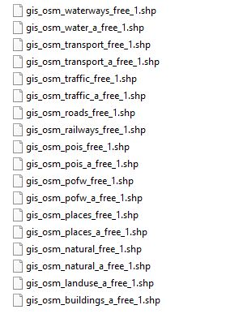

# Get Data

Landscaping supports raster data in various common formats and vector data in ESRI Shapefile format. The Shapefiles have to come with annotations which meet the specs of [geofabrik.de](https://download.geofabrik.de/).

## Raster Data

Landscaping can handle any GeoTiff rasterfile with height data (aka Digital Terrain Model, DTM or Digital Elevation Model, DEM) as well as HGT file format (SRTM1 and SRTM3 data) and ASCII Grid files.
Projection, pixelscale or resolution does not matter.
ASCII Grid files have to have a *.prj file associated which is normally the case if you download it somewhere.
For HGT files the filename must comply to the format NXXWYYY[.optional].hgt which is also normally the case. So please make sure the HGT filename confirms to this convention.

Sources for DTM files are for example:

- [NASA Earth Explorer](https://earthexplorer.usgs.gov/)
- [Viewfinder Panoramas](http://www.viewfinderpanoramas.org/Coverage%20map%20viewfinderpanoramas_org3.htm)
- [OpenTopography](https://portal.opentopography.org/raster?opentopoID=OTSRTM.082015.4326.1)

Better resolutions will also create more detailed landscapes in Unreal Engine 4. __Search the web for the open data portal of your desired country to get better resolutions.__

> Please make sure you understand the data you are trying to import. Downloading a random file and trying to import it without knowing what to expect will hardly lead to success. Read the description of the heightdata file on the website where you are downloading it and think about how big the landscape will be. E.g. importing a 10500 x 8600 pixel GeoTiff with a resolution of 8 meter per pixel will result in a 5780 km² landscape. You can limit the import area in the [DTM Import Options](heights.md?id=options). Importing huge areas might exhaust your system memory and Unreal Engine will crash. Unreal Engine 4 needs about 20 GB RAM per 1000 km².

It is always a good idea to have a look at the data before importing. [QGIS](https://qgis.org/) is a free tool which can be used to see how the data looks like before importing it.

## Vector Data

While it is possible to import any Shapefile through Landscaping into Unreal Engine 4, the plugin is designed to work with [geofabrik.de](https://download.geofabrik.de/) annotated Shapefiles. It will allow you to generate weightmaps, spline based Actors and any other Actor.

After you downloaded the Shapefiles from geofabrik and unzipped the folder a collection of different aspects of the country can be found splitted into many files.

For weightmap generation following files are relevant:

- gis_osm_landuse_a_free_1.shp
- gis_osm_natural_a_free_1.shp
- gis_osm_water_a_free_1.shp

All this files contain POLYGONS, which is necessary to derive weightmaps.
Optionally, gis_osm_buildings_a_free_1.shp can also be used for weightmap generation, but not in conjunction with gis_osm_landuse_a_free_1.shp. However, using gis_osm_buildings_a_free_1.shp is not recommended for bigger landscapes (> 10 km²) because the runtime to generate the appropriate weightmaps will increase a lot.

For spline based Actors, following files are appropriate:

- gis_osm_railways_a_free_1.shp
- gis_osm_roads_a_free_1.shp
- gis_osm_waterways_a_free_1.shp

All this files contain LINESTRINGS, which is necessary to generate rivers, roads, etc.
Optionally, gis_osm_buildings_a_free_1.shp can also be used to procedurally generate buildings. For this purpose, one has to implement the interface [LandscapingVectorInterface](landscapingvectorinterface.md) in a Blueprint or in C++ with custom logic.
