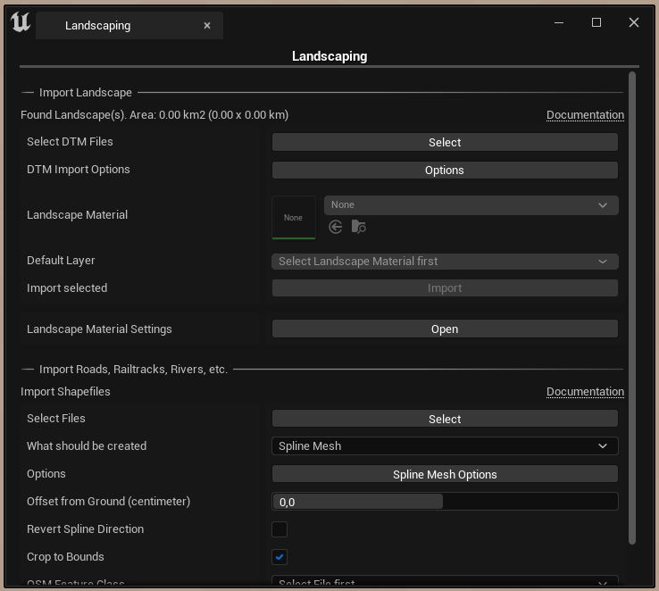

# Get started

## Enable plugin

After you installed the plugin from the marketplace, you have to activate the plugin.

1) Open the Plugins window (Edit -> Plugins)
2) Scroll down until you find 'Landscape' and select it
3) On the 'Landscaping' plugin check the checkbox next to 'Enabled'
4) Unreal Engine asks you for a restart
5) After Unreal Engine has restarted, you should see the Landscaping Icon in the toolbar (in UE5 it is under the Window Menu):

## Import Heightmap

1) Download example heightmaps [GeoTiffExamples](https://cloud.ludicdrive.com/s/4HQPy8phBTxEL4z/download), or use another DTM file.
2) After clicking on Landscaping on the toolbar, the Landscaping tab pops up:

3) Hit the `Select` button and choose your file
4) Then hit the `Import` button and the landscape from the height raster will be transformed into a Unreal Engine landscape within a few seconds

## Next steps

Explore how easy it is to create tiled landscapes: [DTM / Heightmaps](heights.md?id=heights)

Apply a Landscape Material and generate weightmaps on the fly: [Weightmaps / Paint Layers](landcover.md?id=landcover)
