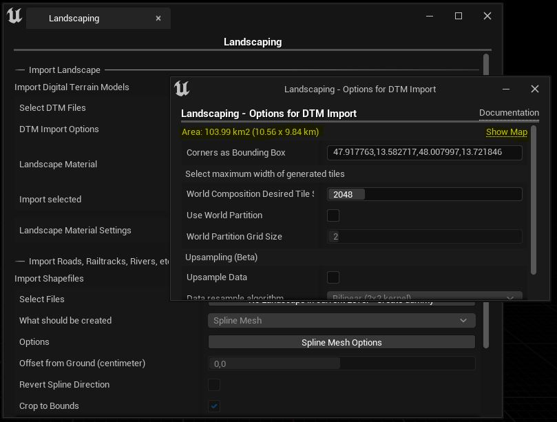

# Let's get high

Making a huge tiled landscape is as easy as making a single landscape.

## Choosing input files

In order to create a tiled landscape, you can choose one or multiple files in the file selection dialog.  
Depending on the [Max Desired Tile Size](#max-desired-tile-size), the tiles for the landscape will be created on the fly.  
> A tiled landscape can be created from a single file or from multiple files

The controlling factor is the [Max Desired Tile Size](#max-desired-tile-size).  
There is only one thing to consider:
> The file size of a single file can be 2 GB max

## Options

The Landscaping plugin allows you to set the desired tile size and if you wish to convert to OSM projection.  

### Use OSM Projection

Wether to use OpenStreetMap/Google Maps projection or keep the original projection of the raster file.
If you do not know, what this means, leave it checked. It's fine. The Landscaping plugin handles everything automatically.

### Max Desired Tile Size

Tiles will have this width max. The unit here is meter.

## Projections

Per default, OSM projection [EPSG:3857](https://epsg.io/3857) is used. If you want to keep the original projection of your raster file, uncheck `Use OSM Projection`.

> Landscaping can handle every projection and converts it automatically. But it is highly recommended to use OSM projection. If the original raster does not use meter as unit, the result can be unsatisfying or the Unreal Editor may even crash. If you check `Use OSM Projection` everything will work fine.

It is possible to import raster files with different projections and resolutions and they will be aligned properly. You do not have to worry about it. It is even possible to import GeoTiff, ASCII and HGT files toghether.  

> Landscaping can handle overlapping files

Datasets handed over to the `Landscaping Plugin` may even intersect, they will be merged and result in a seamless landscape or World Composition.
If you need another Projection please look into the [GIS Expert](gis-expert.md?id=projections) section of this documentation.

## Next Steps

Make the gray checkerd landscape colorful with [Landcover](landcover.md?id=landcover)
