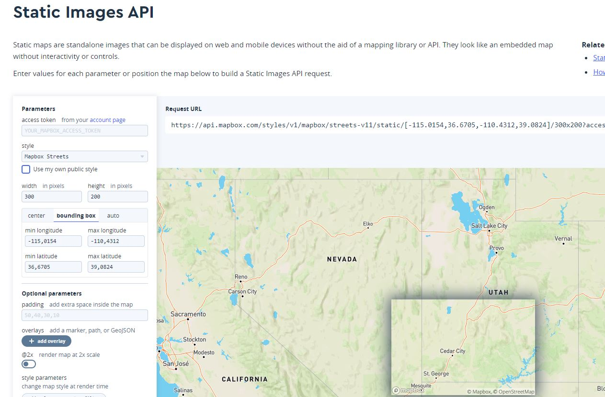

# Heights

Making a huge tiled landscape is as easy as making a single landscape.

## Choosing input files

In order to create a tiled landscape, you can choose one or multiple files in the file selection dialog.  
Depending on the [Max Desired Tile Size](#max-desired-tile-size), the tiles for the landscape will be created on the fly.  
> A tiled landscape can be created from a single file or from multiple files

The controlling factor is the [Max Desired Tile Size](#max-desired-tile-size).  
There is only two thing to consider:
> The file size of a single file can be 2 GB max.  
> Your system memory must keep up with the size of the landscape. About 20 GB RAM are needed per 1000 km².

## Options

The Landscaping plugin allows you to set the desired tile size limit the area to import and specify auxiliary files to fill no data sections.

## Import Area (optional)

Here it is possible to limit the area to import. To get an idea what is imported please use: [Mapbox](https://docs.mapbox.com/playground/static/) and select bounding box in the Parameters on the left hand side. Input the Latitudes and Longitudes according to the values in the `Options for DTM Import` dialog.

## Fill the gaps (optional)

Due to reprojecting the import data steep edges will appear on the outmost borders of the landscape or open world. To prevent this and if limiting the import area is no option for you, auxiliary files can be provided. They should be of the same resolution and encompass the area which you want to import.
Try it out with this corresponding set of files for the examples from [Get Started](get-started.md?id=import-heightmap): [AuxiliaryExample](https://cloud.ludicdrive.com/s/Mfx0NyUsZE2PKXQ/download). Download and unzip the file, and select all files in the `Fill the gaps` file selection dialog.

### Max Desired Tile Size

Tiles will have this width max. The unit here is meter.

## General

It is possible to import raster files with different projections and resolutions and they will be aligned properly. You do not have to worry about it. It is even possible to import GeoTiff, ASCII and HGT files toghether.  

> Landscaping can handle overlapping files

Datasets handed over to the `Landscaping Plugin` may intersect, they will be merged and result in a seamless landscape or World Composition.

> Temporary files are created upon import in the folder of the original heightdata files. The folder `Generated by Landscaping` can be deleted after successful import.

## Next Steps

Make the gray checkered landscape colorful with [Landcover](landcover.md?id=landcover)
