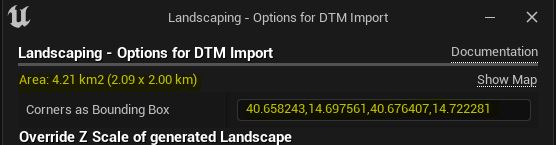

# Heights

Making a huge tiled landscape is as easy as making a single landscape.

## Choosing input files

In order to create a tiled landscape, you can choose one or multiple files in the file selection dialog.  
Depending on the [Max Desired Tile Size](#max-desired-tile-size), the tiles for the landscape will be created on the fly.  
> A tiled landscape can be created from a single file or from multiple files

The controlling factor is the [Max Desired Tile Size](#max-desired-tile-size).  
There is only two thing to consider:
> The file size of a single file can be 2 GB max.  
> Your system memory must keep up with the size of the landscape. About 20 GB RAM are needed per 1000 km².

## Options

The Landscaping plugin allows you to set the desired tile size limit the area to import and specify auxiliary files to fill no data sections.

## Import Area (optional)

Here it is possible to limit the area which should be imported. To get an idea what is imported please click on `Show Map`:  

A browser window opens and shows the area which encompasses the heightdata files:  

Select edit on the toolbar on the right side and drag the rectangle corners until the desired import area is covered:

> The import area has to be smaller than the original area!

After clicking save, the map centers on the new area. Select the coordinates in the adress bar of the browser and copy them (Ctrl+C):

Back in Unreal Engine Editor paste the coordinates (Ctrl+V) in the `Corners as BBox` text input and hit `Enter`:

The info text should now show the new extent of the area and only this part of the heightdata will be imported.

## Fill the gaps (optional)

Due to reprojecting the import data steep edges will appear on the outmost borders of the landscape or open world if import area is not limited. To prevent this and if limiting the import area is no option for you, auxiliary files can be provided. They should be of the same resolution and encompass the area which you want to import.
Try it out with this corresponding set of files for the [examples](get-started.md?id=import-heightmap) from `Get Started`: [AuxiliaryExample](https://cloud.ludicdrive.com/s/Mfx0NyUsZE2PKXQ/download). Download and unzip the file, and select all files in the `Fill the gaps` file selection dialog.

### Max Desired Tile Size

Tiles will have this width max. The unit here is meter. If the tile size is bigger than the extents, only a single landscape (not a world composition) is imported.

## Upsampling

If the input DTM is of low resulution, this option gives you the possibility to make the resulting surface of the landscape smoother. It will result in smoother terrain if the input data is up to 30 meter per pixel. However, if the input data has more then 30 meter per pixel, the output will very likley not be very detailed even with upsampling. If a detailed landscape is wanted, also the input data has to contain details e.g. a resolution of 5 meter or even better 1 meter.

### Upsample checkbox

Wheter to upsample the input data or not. Check it if you want to upsample the input data.

### Data resample algorithm

Select one of 6 resample algorithms. Default is __Bilinear__ and in most cases that's the one which gives the best results. The option leverages algorithms from [gdal](https://gdal.org/programs/gdal_translate.html).

`nearest` applies a nearest neighbour (simple sampling) resampler.  
`bilinear` applies a bilinear convolution kernel.  
`cubic` applies a cubic convolution kernel.  
`cubicspline` applies a B-Spline convolution kernel.  
`lanczos` applies a Lanczos windowed sinc convolution kernel.  
`average` computes the average of all non-NODATA contributing pixels. This is a weighted average taking into account properly the weight of source pixels not contributing fully to the target pixel.  
`mode` selects the value which appears most often of all the sampled points.

### Desired Meter per Pixel

Upsample the inputdata to target this value.

## Only convert to PNGs

Instead of creating a Unreal Engine Landscape or World Composition, only output the heightmaps to pngs. These PNGs can be imported again into unreal as World Composition or even as World Partition (UE5). In the same folder alongside the PNGs, a `LandscapingInfos.txt` is created. Please use the scale info in the text-file on reimport into Unreal Engine, Y-Axis is not flipped. Only `Landscaping Scale X,Y`, `Landscaping Scale Z` and `Flip Tile Y Coordinate` are relevant when reimporting the PNG heightmaps.

## General

It is possible to import raster files with different projections and resolutions and they will be aligned properly. You do not have to worry about it. It is even possible to import GeoTiff, ASCII and HGT files toghether.  

> Landscaping can handle overlapping files

Datasets handed over to the `Landscaping Plugin` may intersect, they will be merged and result in a seamless landscape or World Composition.

> Temporary files are created upon import in the folder of the original heightdata files. The folder `Generated by Landscaping` can be deleted after successful import.

## Next Steps

Make the gray checkered landscape colorful with [Landcover](landcover.md?id=landcover)
