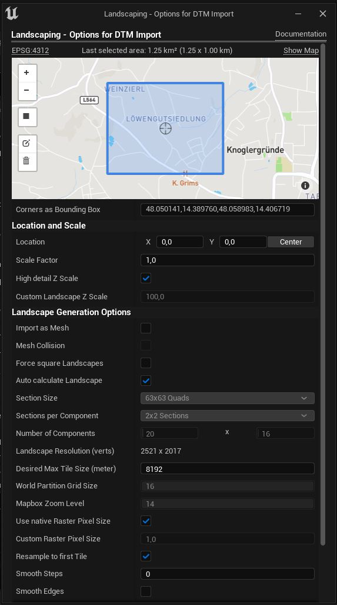
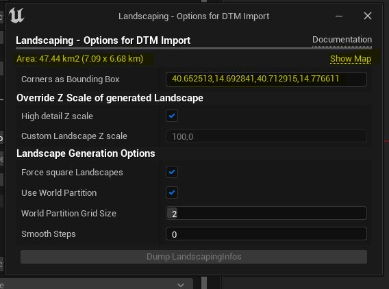
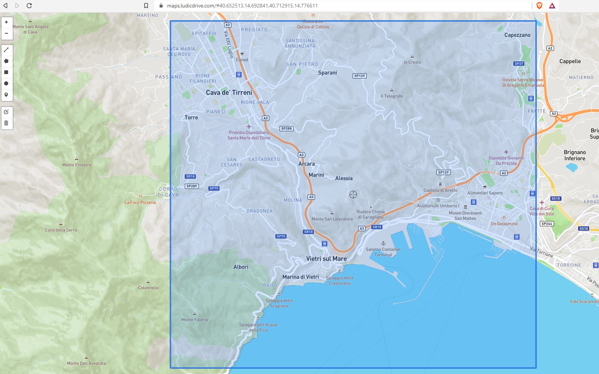

# Heights

Making a huge tiled landscape is as easy as making a single landscape.

> Please make sure that you have enough RAM when importing huge areas!

## Choosing input files

> To reset the input simply close the Landscaping tab and open it again.  

In order to create a tiled landscape, you can choose one or multiple files in the file selection dialog.  
In UE5 it is possible to choose [World Partition](#world-partition) and specify the grid size. (UE4: Depending on the `Max Desired Tile Size`, the tiles for the landscape will be created on the fly.)  

> A tiled landscape can be created from a single file or from multiple files

For `World Partition`, the settings value will control the size of a single Landscape -> see [Settings](settings.md?id=world-partition-max-landscape-size)  
There are only two things to consider:
> The file size of a single file can be 2 GB max.  
> System memory must keep up with the size of the landscape -> see [Max Landscape Size](max-landscape-size.md?id=maximum-landscape-size).

## Options

The Landscaping plugin allows you to set the area to import with the `Corners as Bounding Box` input or in UE5 directly in the DTM Import Options Dialog.  
For downloading heightmaps from Mapbox using the `Landscaping Mapbox` plugin, the import area is also specified here by simply select the desired area to import. (Please note, that Mapbox only has data for land areas, not sea areas).

## Import Area (optional)

> In UE5 (from plugin version 7.0 on), you can simply view and/or select the area on the integrated browser, you do not have to copy-paste the bounding box.

  

> The following step is only necessary for plugin version lower 7.0 and UE4 users  
Here it is possible to limit the area which should be imported. To get an idea what is imported please click on `Show Map`:  
  
> The following step is only necessary for plugin version lower 7.0 and UE4 users  
A browser window opens and shows the area which encompasses the heightdata files:  
  
> The following step is only necessary for plugin version lower 7.0 and UE4 users  
Select edit on the toolbar on the right side and drag the rectangle corners until the desired import area is covered:
  
> When importing DTM files, the import area has to be smaller than the original area!
> The following step is only necessary for plugin version lower 7.0 and UE4 users  
After clicking save, the map centers on the new area. Select the coordinates in the adress bar of the browser and copy them (Ctrl+C):

> The following step is only necessary for plugin version lower 7.0 and UE4 users  
Back in Unreal Engine Editor paste the coordinates (Ctrl+V) in the `Corners as Bounding Box` text input and hit `Enter`:  

The info text should now show the new extent of the area. Only this part of the heightdata will be imported.

## Override Z Scale of generated Landscape

### High Detail Z Scale

The vertical scale will be calculated automatically to perserve the most detail, using the maximum available Unreal Engine Landscape vertical resolution. Defaults to `true`. This should be set to `false` when extending or updating the heightmaps.  

### Custom Landscape Z Scale

Use this for areas with low altitude difference or when extending or updating the landscape. Defaults to `100`. For understanding the technical reason for this, please consult [Calculating Heightmap Z Scale](https://docs.unrealengine.com/5.1/en-US/landscape-technical-guide-in-unreal-engine/).  

### Import as Mesh

> Only available in Unreal Engine 5  

Import as Procedural Mesh instead of Landscape (e.g. for a distance mesh). The Procedural Mesh can afterwards converted to a nanite mesh with a button in the details panel of the Procedural Mesh.

### Force square Landscapes

> Only available in Unreal Engine 5  

Regardles of the selection, force a square landscape. This enables to export/import weightmaps in the native UE Landscape Edit Mode (e.g. for editing weightmaps in another program)

### Use World Partition

> Only available in Unreal Engine 5  

Check this to create a Landscape / Open World with World Partition (usually you want it). If not using World Partition, the Landscape can be 8192 meters max (x or y direction).  

> Please make sure you use the `Empty Open World` Template when enabling World Partition and check `Enable Streaming` in World Settings

### World Partition Grid Size

> Only available in Unreal Engine 5  

Grid size for the World Partition Landscape.

### Smooth Steps

> Only available in Unreal Engine 5

Apply gaussian blur on the height data before importing the landscape. This will smooth raster data with low resolution.  
0 means, no smoothing will happen.
For Mapbox imports the recommended value is 1 for mountain terrain, and 2 for flat terrain.  

## Landscape Update Options

> This only is available in World Partition

### Update Landscape

Wheter to update an already imported area (area must be a Landscape)

### Only fill missing

Only update areas with no data -> Please see the youtube video 

> This option is only meaningful, if you try to fill missing data with mapbox, otherwise a faster way to fill missing data is just selecting (`Select DTM Files` button) all heightmap data (geotiff-, ascii- or hgt-files, also mixed is possible) and let them merge on import automatically.

### Minimum height tolarance

The distance between the lowest valid point of an already imported landscape and the bottom flat area (no data area) in centimeter

### Dump LandscapingInfos

Write metadata to a textfile

## Landscape Material

Assign a Landscape Material which will be applied to the imported Landscape.

## Default Layer

The Landscape Material's default paint layer, with which the landscape will be filled.  
> Brushify's first layer makes the Landscape invisible - if you are using Brushify, choose an appropriate layer here.

## General

It is possible to import raster files with different projections and resolutions and they will be aligned properly. You do not have to worry about it. It is even possible to import GeoTiff, ASCII and HGT files toghether. However: files with different resolutions (meter per pixel) will be result in seams (where more detailed and less details heightmaps meet).

> Landscaping can handle overlapping files

Datasets handed over to the `Landscaping Plugin` may intersect, they will be merged and result in a seamless landscape or World Composition.

> Temporary files are created upon import in the folder of the original heightdata files. The folder `Generated by Landscaping` can be deleted after successful import.

## Next Steps

Make the gray checkered landscape colorful with [Weightmaps / Paint Layers](landcover.md?id=landcover)
