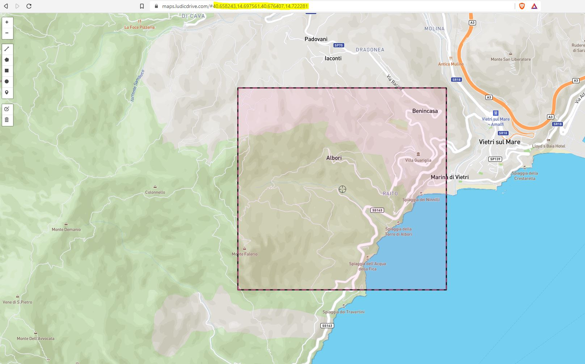

# Heights

Making a huge tiled landscape is as easy as making a single landscape.

## Choosing input files

> To reset the input simply close the Landscaping tab and open it again.  

In order to create a tiled landscape, you can choose one or multiple files in the file selection dialog.  
In UE5 it is possible to choose [World Partition](#world-partition) and specify the grid size. (UE4: Depending on the `Max Desired Tile Size`, the tiles for the landscape will be created on the fly.)  

> A tiled landscape can be created from a single file or from multiple files

For `World Partition`, the settings value will control the size of a single Landscape -> see [Settings](settings.md?id=world-partition-max-landscape-size)
There are only two things to consider:
> The file size of a single file can be 2 GB max.  
> System memory must keep up with the size of the landscape -> see [Max Landscape Size](max-landscape-size.md?id=maximum-landscape-size).

## Options

The Landscaping plugin allows you to set the area to import with the `Corners as Bounding Box` input.  
For downloading heightmaps from Mapbox using the `Landscaping Mapbox` plugin, the import area is also specified here.

## Import Area (optional)

Here it is possible to limit the area which should be imported. To get an idea what is imported please click on `Show Map`:  

A browser window opens and shows the area which encompasses the heightdata files:  

Select edit on the toolbar on the right side and drag the rectangle corners until the desired import area is covered:

> When importing DTM files, the import area has to be smaller than the original area!

After clicking save, the map centers on the new area. Select the coordinates in the adress bar of the browser and copy them (Ctrl+C):

Back in Unreal Engine Editor paste the coordinates (Ctrl+V) in the `Corners as Bounding Box` text input and hit `Enter`:

The info text should now show the new extent of the area. Only this part of the heightdata will be imported.

## Override Z Scale of generated Landscape

### High Detail Z Scale

The vertical scale will be calculated automatically to perserve the most detail, using the maximum available Unreal Engine Landscape vertical resolution. Defaults to `true`.

### Custom Landscape Z Scale

Use this for areas with low altitude difference to correct wrong slope calculation of Marketplace Landscape Materials (like Brushify or PLE). Defaults to `100`.

### Use World Partition

> Only available in Unreal Engine 5  

Check this to create a Landscape / Open World with World Partition (usually you want it).  

> Please make sure you use the `Empty Open World` Template when enabling World Partition and check `Enable Streaming` in World Settings

### World Partition Grid Size

> Only available in Unreal Engine 5  

Grid size for the World Partition Landscape.

### Smooth Steps

> Only available in Unreal Engine 5

Apply gaussian blur on the height data before importing the landscape. This will smooth raster data with low resolution.  
0 means, no smoothing will happen.
For Mapbox imports the recommended value is 1 for mountain terrain, and 2 for flat terrain.  

### Dump LandscapingInfos

Write metadata to a textfile

## Landscape Material

Assign a Landscape Material which will be applied to the imported Landscape.

## Default Layer

The Landscape Material's default paint layer, with which the landscape will be filled.  
> Brushify's first layer makes the Landscape invisible - if you are using Brushify, choose an appropriate layer here.

## General

It is possible to import raster files with different projections and resolutions and they will be aligned properly. You do not have to worry about it. It is even possible to import GeoTiff, ASCII and HGT files toghether.  

> Landscaping can handle overlapping files

Datasets handed over to the `Landscaping Plugin` may intersect, they will be merged and result in a seamless landscape or World Composition.

> Temporary files are created upon import in the folder of the original heightdata files. The folder `Generated by Landscaping` can be deleted after successful import.

## Next Steps

Make the gray checkered landscape colorful with [Weightmaps / Paint Layers](landcover.md?id=landcover)
