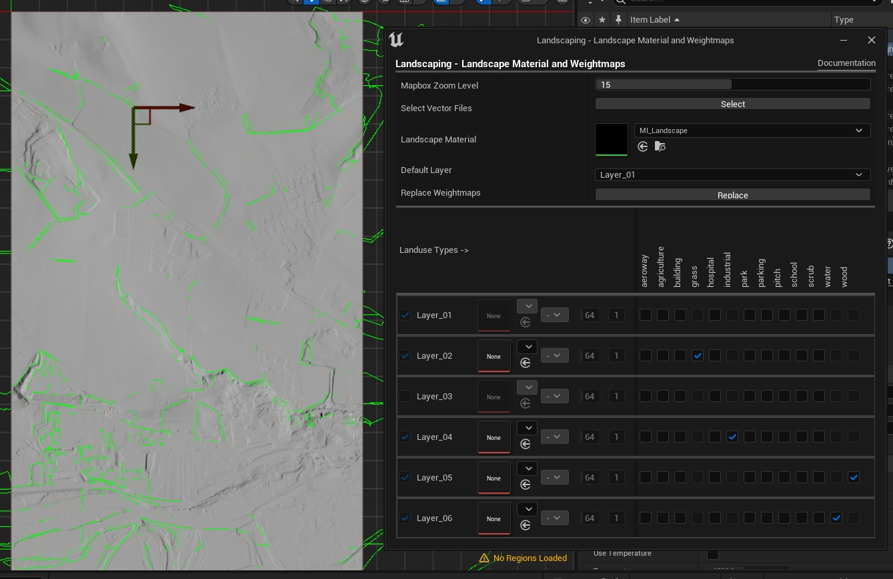

# Landcover

Applying a Landscape Material and generating weightmaps on the fly. The good thing about it: no preprocessing of data is needed. We only have to download some Shapefiles.

## Get it from the web

Landscaping is designed to work with OpenStreetMap Data Extracts from Geofabrik. [Download](https://download.geofabrik.de/) the Shapefiles from your country and extract the zip-file. For the example files please download the Shapefiles from `Austria` in Europe.

## Importing Shapefiles

> Please unload all tiles before proceeding

When clicking on the `Open` button next to Landscape Material Settings a new window pops up. Hit the `Select` button and choose `gis_osm_landuse_a_free_1.shp` or multiple files (see [Get Data](get-data.md?id=vector-data)) from the extracted files. It is possible to select several Shapefiles at once. It may take a few seconds until the file is read. After that, choose the Landscape Material in the next step.

## Landscape Material

Pick a Landscape Material from your content folder. I like the Brushify Landscape Material. But every other Landscape Material is fine as well.

## Material Layers

A whole bunch of checkboxes will appear. So what is that about? Well, here we assign the layers of the Landscape Material to one or multiple landcover types aka landuses. One Material Layer can have one or more landcover types but not vice versa. Notice, that the column of the landcover type gets grayed out, if you assign it to a Material Layer. If a Material Layer has the same name as the landcover type, it will appear already selected. It is not mandatory, to select every landuse type nor Material Layer. Weightmaps will only be created for those landuses, which are assigned to a Material Layer. For everything else, the Default Layer is used.

> All Material Layers in use are generated as weightblended

## Default Layer

The Default Layer is used everywhere, on the landscape, if there is no other landuse type assigned. In areas, which have another layer, the Default Layer has a weight of 10%.

## Wait for it

When pleased with the mapping hit the `Replace` Button. It will erase the current weightmaps and replace them with the new settings.

Depending on the extent of the landscape and wether it is tiled or not, it will take several minutes to hours until all calculations are finished and you can see the result.

## Notes on runtime

The generation of weightmaps can take time. Roughly it takes 10 seconds per km² per distinct landuse area. If the landscape is huge and has many distinct areas, this adds up. For example, an area in the alps with ~ 220 km² and moderate distinct areas took about 39 minutes to calculate. Another test with a ~ 650 km² world and a lot of small distinct areas took a little more than 3 hours and 30 minutes to finish. Of course it depends on the machine you are using, mainly on the number of cores of your CPU. So, if you plan to generate huge worlds, please consider this. All tests where performed with a AMD Ryzen 3 2600 CPU with 32 GB RAM. Still, this is a lot faster than every other method and it is very accurate.

## Next steps

After having the ground set, let's grow some bushes and trees: [Vegetation](vegetation.md?id=vegetation)  
Or lay a river in the riverbed: [Props](props.md?id=props)
