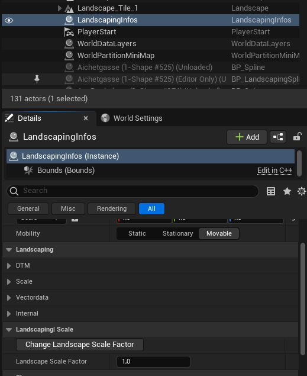

# LandscapingInfos Actor

After opening the `Landscaping Tab` an Actor called `LandscapingInfos` is created in the scene. The Actor can be selected like every Actor in the World Outliner in the Unreal Engine Editor.

In the Details Panel of the Unreal Engine Editor you can see different section belonging to Landscaping. They mainly hold metadata so that the `Landscaping Plugin` can do it's work properly. It's properties are described in the tooltip (hover with mouse cursor over property name).

> Please do not delete the `LandscapingInfos` Actor as long as you plan to work with the `Landscaping Plugin` in the editor.

The Actor is an Editor Only actor and will therefore automatically __not__ be included when packaging the project.

## Options in the Landscaping Section (Details Panel)

Select `LandscapingInfos`in the Outliner. Under `Landscaping` following options are provided.

## DTM

### Allowed DTM File Types

Landscaping is using [GDAL](https://gdal.org/) under the hood. It is tested to import GeoTiff, ASCII, HGT and GeoPackage files properly. However, it should work with every driver built in with the GDAL library.

Changing the `Allowed DTM file Types` allows you to select other DTM files. See [Settings](settings.md) for how to change the allowed file types. A list with possible file formats can be found at [Raster drivers](https://gdal.org/drivers/raster/index.html).

> There is no guarantee, that other file types work. Trying to import other files than what GDAL supports might crash the Unreal Editor.

### Use Precise Scale

Deprecated. Wheter to use precise scale (double). Default is true.  

## Scale

### Landscape Scale Factor

For special purpouses, if one wishes to create World Partition with a different scale than the real world scale, the Landscape Scale can be overwritten with `Landscape Scale Factor`.
Landscape Scale effects both, the scale of the final Landscape imported from DTM files and the points of the Shapefile.

> The internal calculated scale of the resulting Landscape will be multiplied with this value. E.g. if the value is set to 0.3048 the resulting Landscape size will be result as if the import unit is feet (default is meter).  

After import, the scale of the scene can be changed through the button `Change Landscape Scale Factor`. It will then change all actors in the scene to the new scale to keep proportions.

## Vectordata

### Vector Data Scale

Like Landscape Scale, the points of the Vector can be scaled independently, even after they were loaded, but only before they are imported. The `Vector Data Scale` let's you specify at which scale the Vector Data should be imported.

### Draw Vector Data Debug

After selecting shapefiles in the `Weightmaps and Landscape Material` dialog or in the `Import Roads, Railtracks, Rivers, etc.` section, the vector data is already loaded. To visualize it, set `Draw Vector Data Debug` to true. It will draw lines over the Landscape to preview, where the vector data from the Shapefile will be imported.

By changing `Vector Data Scale` the change of the scale will also be reflected by it.

When selecting OSM feature classes in the `Import Vector data` dialog section (Splines / Actors / Blueprints) or assign feature classes to a Landscape Material Layer in the `Landscape Material` dialog (Weightmaps / Paint Layers), the vector data which will be imported will be reflected in the debug view.  

### Snap to Ground

Snap the vector point to the ground of the Landscape. This might lead to framedrops if huge shapefiles are imported.

### Debug Update Interval

To save performance, the update interval of the debug drawing can be controlled here.

### Offset from Ground

To set `Offset from Ground` please see `Import Vector data` dialog section (Splines / Actors / Blueprints).

### XYOffset

Offset of the Bounds. The offset specifies the Origin of any vectordata imported (shapefiles for Roads etc. or shapefiles for Weightmaps). Also it moves the vectordata crop area which is visualized with a dark-orange rectangle.

## Internal

This section hold metadata for georeferencing and consequtive imports. For informational and debug purposes only.

## Landscaping| Scale

See scale section above.
