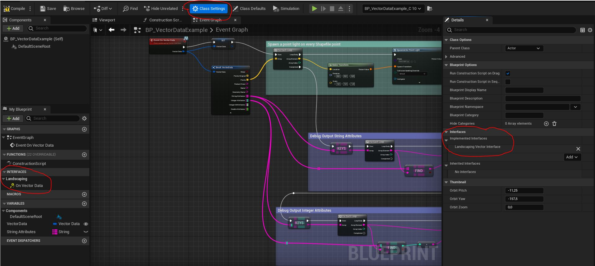
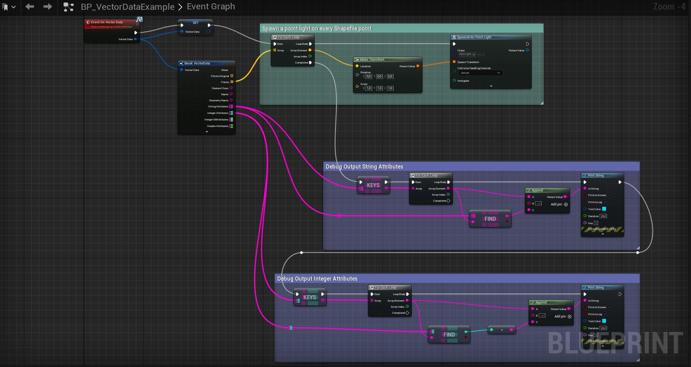
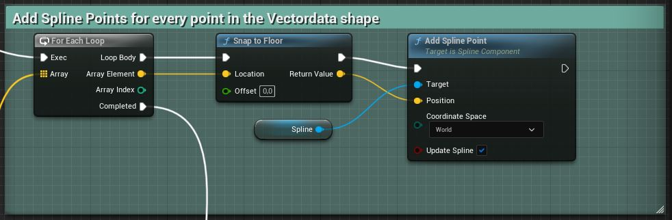

# Custom Logic on Vector Data

With a C++ class or Blueprint implementing the `LandscapingVectorInterface`, custom logic on importing LINESTRINGS, POLYGONS and POINTS from a Shapefile can be fired off.  

  

The `Landscaping Plugin` will instantiate the Blueprint at the first point of the LINESTRING, POLYGON or POINT and will call `OnVectorData` which can be implemented as `OnVectorData_Event` in the Blueprint. `OnVectorData` will give you a struct of `FVectorData`:

- __bool__ `Show` -> used for internal debugging purposes only
- __TArray < FVector >__ `Points` -> Points, which make up the shape
- __TArray < FVector >__ `PointsOriginal` -> Points, without altitude-, scale- and offset-correction
- __FString__ `FeatureClass` -> OSM feature class (may be empty if other Shapefiles than from geofabrik.de are loaded)
- __FString__ `Name` -> Name of the shape (may be empty)
- __FString__ `GeometryName` -> Type of the shape, e.g. LINESTRING, POLYGON or POINT
- __TMap < FString , FString >__ `StringAttributes` -> string attributes found for this shape in the shapefile
- __TMap < FString , int >__ `IntegerAttributes` -> integer attributes found for this shape in the shapefile
- __TMap < FString , int64 >__ `Integer64Attributes` -> 64 bit integer attributes found for this shape in the shapefile
- __TMap < FString , double >__ `DoubleAttributes` -> float and double attributes found for this shape in the shapefile  

After calling `OnVectorData` the plugin will move on to the next shape, instantiating the Blueprint at the first point of the LINESTRING, POLYGON or POINT, call `OnVectorData` like above and so on.

> This is a convinient way to set up custom logic and can be used to construct buildings etc.

An example how this works and how to use it in a Blueprint is shipped with the plugin in the Content/Blueprints folder: `BP_VectorDataExample`.
The example will instantiate a Point Light on the location of every vector data point.

To use your custom Blueprint, select it under `Blueprint` in the `Import Roads, Railtracks, Rivers, etc.` section.

## Shapefile Attributes

> Attributes TMaps are only available for UE5  
Attributes of a shapefile can be accessed through the `LandscapingVectorInterface` as shown below from `BP_VectorDataExample`:  

  

## Snap to Floor

> The blueprint has to have `EditorUtilityActor` as Parent Class (`Class Settings -> Parent Class`)

A blueprint utility function `Snap to floor` is usefull to snap the vector data points to the surface of the landscape.  
The offset can be positive or negative. It determines the vertical offset from the surface.  

 
