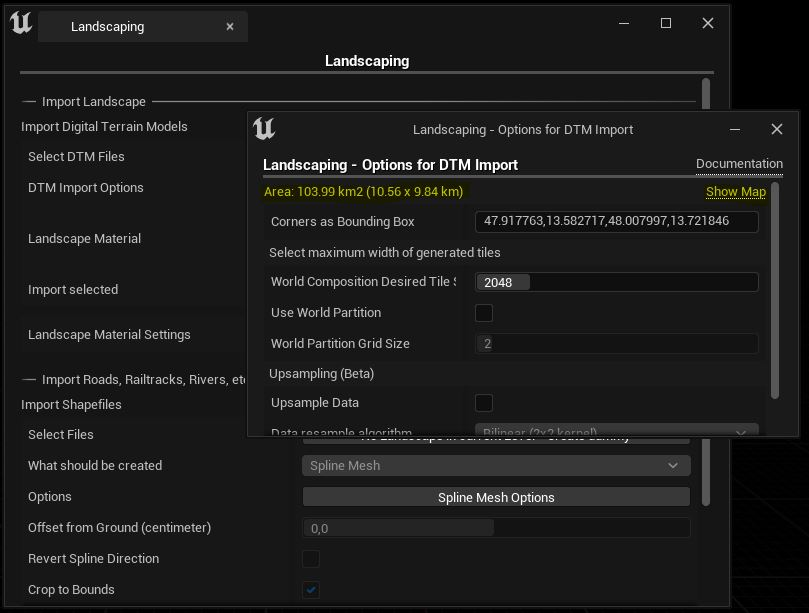
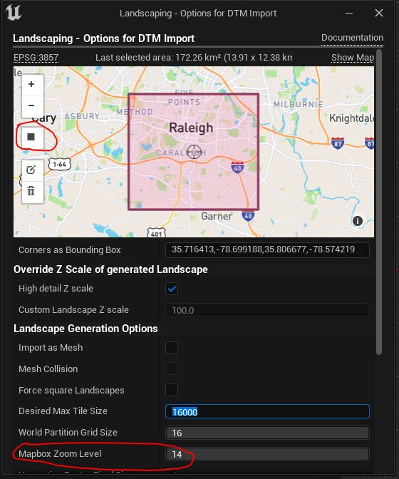
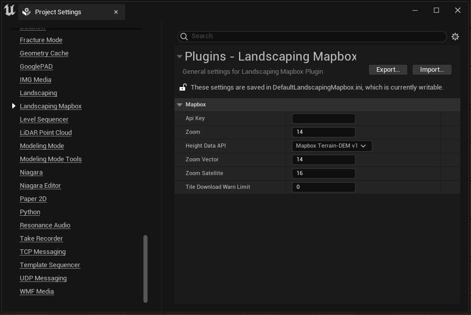
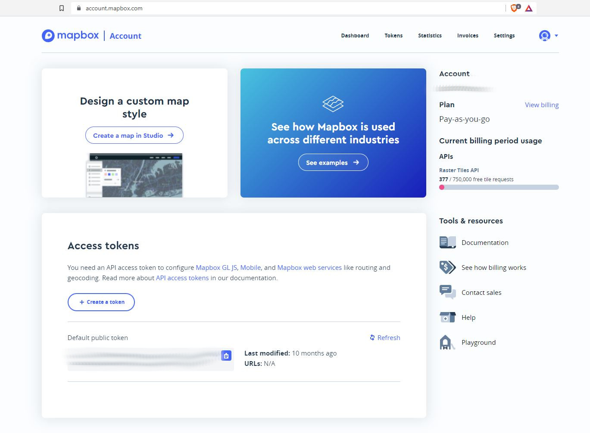

# Mapbox

With the extension [Landscaping Mapbox](https://www.unrealengine.com/marketplace/en-US/product/landscaping-mapbox) heightmap tiles from Mapbox can easily be imported.
Therefore only the extents of the area to import must be selected in the [DTM Import Options](heights?id=import-area-optional) dialog. (In UE4 the extents (bounding box) of the area must be pasted into the [DTM Import Options](heights?id=import-area-optional) dialog).  
The heightmaps will be downloaded automatically and the Landscape / World Composition / World Partition will be created.  

## Mapbox Data

### Heightmap data

The heightmap data used is `Mapbox Terrain-DEM v1` or `Mapbox Terrain-RGB v1` - it can be chosen in the Settings.  
Depending on the area, the highest zoom level is 14 or 15. Despite Mapbox claims that for `Mapbox Terrain-DEM v1` data until zoom level 15 is available, it is only availalbe up to zoom level 14 for most regions. `Mapbox Terrain-DEM v1` will be loaded with double resolution and is therefore from the same quality as ``Mapbox Terrain-RGB v1`.  
[Mapbox Terrain-DEM v1](https://docs.mapbox.com/data/tilesets/reference/mapbox-terrain-dem-v1/)  
[Mapbox Terrain-RGB v1](https://docs.mapbox.com/data/tilesets/reference/mapbox-terrain-rgb-v1/)  
Resolutions for each zoom level can be looked up here: [Zoom Level Reference](https://docs.mapbox.com/help/glossary/zoom-level/)  

### Vector data

Vector data for spline, Actor, Blueprint as well as weightmap generation used is `Mapbox Streets v8`.  
[Vector Tiles](https://docs.mapbox.com/data/tilesets/reference/mapbox-streets-v8/)

### Satellite data

Satellite data used is `Mapbox Satellite`.  
[Mapbox Satellite](https://docs.mapbox.com/data/tilesets/reference/mapbox-satellite/)  

## Setup and Import

1. Enable the plugin in the Plugins Tab (`Edit -> Plugins`)
2. Please make sure to provide your Mapbox API key in `Project Settings -> Plugins -> Landscaping Mapbox`.
3. Open Landscaping plugin from the Toolbar  
  
4. Click on `Options` next to `DTM Import Options`

> In UE5 you can directly select the area in the `DTM Import Options` and do not have to copy-paste the values from the browser  
>   
>
> - Select the filled black rectangle on the left side of the maps UI  
> - Draw a rectangle what area should be imported
> - Select the Mapbox Zoom Level
> - Continue with point 8. below

5. Click on `Show Map` on the top right corner -> a browser window with the map of the world will open
6. Make a bounding box with the rectangle tool from the left hand side
7. Copy - Paste the coordinates from the address after the # into the `Corners as bounding box` input field - the approximate area, which will be imported will appear on the top left corner. (Please do not import areas greater than a couple of thousand square kilometers, Unreal Engine needs about 20 GB RAM per 1000 km² landscape).
8. Close the `DTM Import Options` dialog
9. Hit `Import`

> See also [DTM Import Options](heights?id=import-area-optional)

### Notes on blocky terrain from Mapbox

Mapbox does not provide all areas of the world in the same quality. Therefore it might happen that terrain appears blocky due to poor upsampling from Mabpox.  
The data is processed 'as is', so the blockyness comes from Mapbox itself.
Solution: lower the `Mapbox Zoom Level` before import.

## Import Satellite data

After heightdata is imported, click on `Add Satellite Image` and a dialog appears asking you to automatically download from mapbox. See also [Satellite](satellite?id=satellite)

## Import Vector Tiles

When importing weightmaps or roads, railtracks, rivers etc. you will be asked if you want to download Vector data from Mapbox after clicking `Select`.

## Settings

Settings for the Plugin can be found under `Project Settings -> Plugins -> Landscaping Mapbox`.

### API key

The Api key (Public Access Token) for Mapbox. Please look it up in your mapbox account. Mapbox allows for 750000 free calls on the tiles API, which is probably more than you will ever need for the Landscaping Mapbox plugin. The Landscaping plugin caches the tiles locally, which means reimporting the landscape will not result in additional calls to Mapbox.

### Zoom

Please see [Mapbox zoom level](https://docs.mapbox.com/help/glossary/zoom-level/) for more information what zoom level fits your use-case.

The zoom level of the heightmap tile.  
> This value will be overridden by the import UI.  
Best heightmaps will be delivered with zoom 14, which translates to an accuracy of ~ 2 to 5 meters.

### HeightDataAPI

Query heightdata from `Mapbox Terrain-DEM v1` or `Mapbox Terrain-RGB v1` data.  
`Mapbox Terrain-DEM v1` is the optimized version but `Mapbox Terrain-RGB v1` offers data until zoom level 15. See [Heightmap Data](mapbox?id=heightmap-data)

### Zoom Vector

Zoom for vector tiles.  
> This value will be overridden by the import UI.  
14 is the default value and has world coverage.  
30 is the heighest, most detailed, but will download a massive amount of data even on small areas.  
NOTE: If you see areas without vector data in the debug lines view, the zoom level is to high, and mapbox cannot provide data for that area.

### Zoom Satellite

Zoom for satellite images.  
> This value will be overridden by the import UI.  
16 is the default value and has world coverage, 18 has a resolution of 0.3-0.6 meter almost everywhere.  
21 is the best (7.5 centimeter, some areas of US, Canada, Europe, and Australia) - but it will download a lot of data even on small areas and will take quite some time.  
> CAUTION: you might exceed your mapbox free tier when downloading at zoom 18 - 21.
> Also it only make sense on small areas, because the texture resolution in Unreal Engine is limited with 8k
NOTE: If you see black areas in the result, the zoom level is to high, and mapbox cannot provide data for that area.  

### Tile Download Warn Limit

Enable a warning message popup before downloading more than a certain number of tiles (e.g. > 1000 tiles), to not accidently exeed the free tier of Mapbox.
Currently the free tier include 750,000 raster tiles (heightmap/satellite) and 200,000 vector tiles per month.
A value of 0 means no warn messages and is the default.
