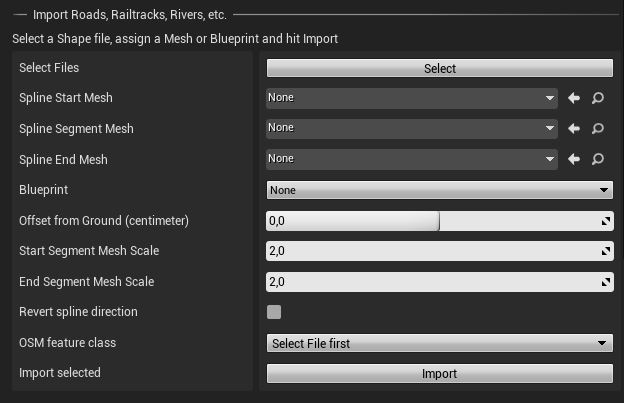

# Props

Landscaping let you create rivers, streets, railroads etc. from Shapefiles with Unreal Engine 4 Spline Component. Here, like in the section about landcover, please see [Get Data](get-data.md?id=vector-data) what input files are suitable for this task.

> Importing vector data from Shapefiles is meant to lay out a scene quickly. It will not get you a final result. Post editing will be needed to adjust the generated splines or Blueprints.

## Generate from Mesh or Blueprint

1) Select a file with LINESTRINGS (see [Get Data](get-data.md?id=vector-data))
2) Define what should be generated along the lines of the imported Shapefile:  
    a. Select at least a `Spline Segment Mesh` or  
    b. Select a `Blueprint` or Actor. The Blueprint has to have a spline component attached or must implement [LandscapingVectorInterface](landscapingvectorinterface.md)

3) `Offset from Ground` specifies how much space will be between the surface of the Landscape and the point of the spline or instantiated Bluprint/Actor
4) `Start Segment Mesh Scale` and `End Segment Mesh Scale` is the scale factor applied to the spline mesh width.
5) `Revert Spline Direction` can be used, if a river is imported and flows upstream. This can happen, if the LINESTRING from the Shapefile is drawn in the wrong direction. There is no way to detect this automatically, because the LINESTRINGS normally do not have height information.
6) With `OSM feature class` you can control, what type of features will be instatiated with the Blueprint or Spline. A river should have another Blueprint than a stream and a path another Blueprint than a highway. This dropdown let you select the apropriate feature class of the LINESTRING for the Blueprint which should be instantiated in the Landscape.

> Please make sure to unload all Levels of a World Composition (except the Persistent Level) in the Unreal Engine `Levels` tab before hitting `Import`

7) Hit `Import`

> You can change the selection of the mesh or blueprint and the OSM Feature Class and hit the `Import` button again, e.g. to generate a highway, secondary roads and pathways with different meshes.
