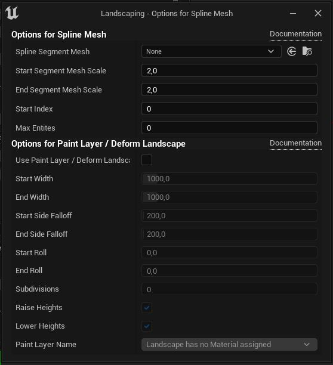

# Props

Landscaping let you create rivers, streets, railroads etc. from Shapefiles with Unreal Engine 4 Spline Component. Here, like in the section about landcover, please see [Get Data](get-data.md?id=vector-data) what input files are suitable for this task. Generally, every Shapefile will do.

> Importing vector data from Shapefiles is meant to lay out a scene quickly. Depending on the quality of the Shapefile, it will or will not get you a final result. Post editing might be needed to adjust the generated splines or Blueprints, especially when generating spline Actors with Shapefiles from geofabrik.de.

## Generate from Mesh or Blueprint

> If you are working with World Composition: please __unload__ all tiles before proceeding  

1) `Select` a Shapefile  

> To reset the input simply close the Landscaping tab and open it again.  
> If no Landscape is found in the scene, it is possible to create a dummy landscape with no extents here.  
> If a Landscape was not imported through the Landscaping plugin, a popup will appear prior to selecting a Shapefile:  
  
> a. `Select LandscapingInfos.txt` let you set the GIS anchor from a textfile, which was [exported prior with PNGs](heights.md?ìd=only-convert-to-pngs).  
> b. `Autodetect` trys to set the CRS (Coordinate Reference System) and anchor from the Shapefile. This will not match the landscape, but with the LandscapingInfos Actor in the World Outliner, the Anchor can be moved to match the shapes with the Landscape - see [Enable Vector Debugging](gis-expert.md?id=draw-vector-data-debug).  

2) Define what should be generated along the lines of the imported Shapefile: select `Spline Mesh` or `Actor` or `Paint Layer / Deform Landscape` from the dropdown. then open the dialog with the button right below the dropdown.  

  

Depending on what is selected in the dropdown, there are 3 different dialogs, but all contain also the options of the latter (`Paint Layer / Deform Landscape`).  
    a. __Spline Mesh__  
    `Spline Segment Mesh` is the Static Mesh, which will be repeated along the spline.
    `Start Segment Mesh Scale` and `End Segment Mesh Scale` is the scale factor applied to the spline mesh width.  
      
    b. __Actor__  
    Select a `Blueprint` or `Actor`. The Blueprint has to have a spline component attached or must implement [LandscapingVectorInterface](landscapingvectorinterface.md)  
      
    c. __Paint Layer / Deform Landscape__  
    With this options, the Landscape can be raised or lowered along the spline, also painting a Landscape Material Paint Layer along the spline is supported (uncheck raise and lower heights if you just want to paint a layer). Note, that a spline actor is created and has additional options to perform actions after import. It can be deleted, if no more manipulation of the Landscape is required.
      

3) `Offset from Ground` specifies how much space will be between the surface of the Landscape and the point of the spline or instantiated Bluprint/Actor
4) `Revert Spline Direction` can be used, if a river is imported and flows upstream. This can happen, if the shape from the Shapefile is drawn in the wrong direction. When [Draw Vector Data Debug](gis-expert.md?id=draw-vector-data-debug) is enabled, you can zoom in and see an arrow on the first segment of the shape, indicating the direction.
5) `Crop to bounds` controls if the shapefiles should be cropped to the bounds of the Landscape or World Composition or World Partition. This is especially relevant when importing shapefiles independently without prior import of DTM with the Landscaping plugin. If the Landscape is imported through the plugin, the option defaults to true and cannot be changed.
6) With `OSM feature class` you can control, what type of features will be instatiated with the Blueprint or Spline when using shapefiles from geofabrik.de. A river should have another Blueprint than a stream and a path another Blueprint than a highway. This dropdown let you select the apropriate feature class of the shape for the Blueprint which should be instantiated on the Landscape. On other shapefiles than from geofabrik.de this will default to `ALL`.

> Please make sure to __unload__ all Levels of a World Composition (UE4) (except the Persistent Level) in the Unreal Engine `Levels` tab before hitting `Import`.  

7) Hit `Import`
