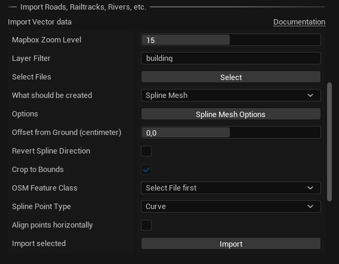
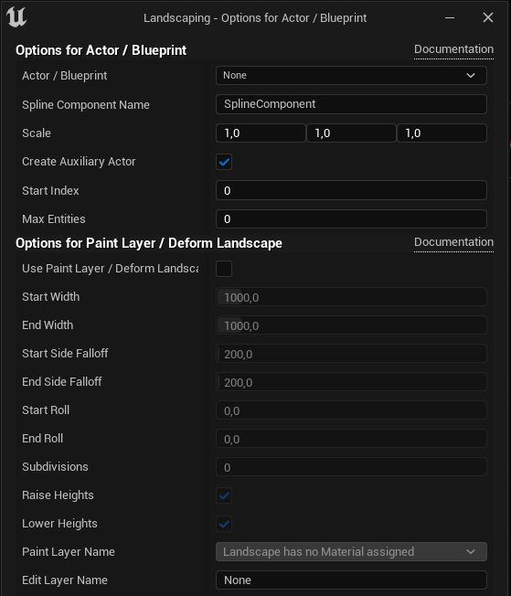

# Props

Landscaping let you create rivers, streets, railroads etc. from Shapefiles with Unreal Engine Spline Component. Here, like in the section about landcover, please see [Get Data](get-data.md?id=vector-data) what input files are suitable for this task. Generally, every Shapefile (also GeoJSON or GeoPackage with vector data) will do.

> Importing vector data from Shapefiles is meant to lay out a scene quickly. Depending on the quality of the Shapefile, it will or will not get you a final result. Post editing might be needed to adjust the generated splines or Blueprints, especially when generating spline Actors with Shapefiles from geofabrik.de.

## Generate from Mesh or Blueprint

> If you are working with UE4 World Composition: please __unload__ all tiles before proceeding  

0) `Mapbox Zoom Level` Zoom Level for Mapbox vector data import. See [Mapbox Documentation](mapbox.md). Only available with Mapbox Extension.
1) `Select` a Shapefile, GeoJSON, OSM or GeoPackage file  (to reset the input simply close the Landscaping tab and open it again)  

2) Define what should be generated along the lines of the imported Shapefile: select `Spline Mesh` or `Actor` or `Paint Layer / Deform Landscape` or `Landscape Spline` (UE 5.1 onwards) from the dropdown. then open the dialog with the button right below the dropdown.  

  

Depending on what is selected in the dropdown, there are 3 different dialogs, but all contain also the options of the latter (`Paint Layer / Deform Landscape`).  
    a. __Spline Mesh__  
    `Spline Segment Mesh` is the Static Mesh, which will be repeated along the spline.
    `Start Segment Mesh Scale` and `End Segment Mesh Scale` is the scale factor applied to the spline mesh width.  
    `Start Index` can be used to create Splines in chunks - this can be repeated multiple times see also `Max Entities`  
    `Max Entities` is the number of Splines to be created (`0` means all)  
    > Please see the tool tips on every option to see an explanation what it's for  
      
    b. __Actor__  
    Select a `Blueprint` or `Actor`. The Blueprint has to have a spline component attached if LINESTRINGS or POLYGONS are processed, or must implement [LandscapingVectorInterface](landscapingvectorinterface.md) - if only POINTS are processed, every actor or blueprint can be selected here.  
    `Scale` can be used to set the scale of the spawned Actor / Blueprint  
    `Create Auxiliary Actor` - whether to create an actor for every spawned Actor / Blueprint with landscape manipulation options  
    `Start Index` can be used to create shapes of the shapefile in chunks - this can be repeated multiple times see also `Max Entities`  
    `Max Entities` is the number of shapes of the shapefile to be created (`0` means all)  
    > Please see the tool tips on every option to see an explanation what it's for  
      
    c. __Paint Layer / Deform Landscape__  
    With this options, the Landscape can be raised or lowered along the spline, also painting a Landscape Material Paint Layer along the spline is supported (uncheck raise and lower heights if you just want to paint a layer). Note, that a spline actor is created and has additional options to perform actions after import. It can be deleted, if no more manipulation of the Landscape is required.  
    > Please see the tool tips on every option to see an explanation what it's for  
      
    d. __Landscape Spline__  (UE 5.1)  
    Landscape Spline is a special type of spline actor, which works on Landscape Edit Layers in an non-destructive way. See end of the page on how to enable Edit Layers on a landscape. While Edit Layers will automatically enabled by the Landscaping Plugin when importing Vector data as `Landscape Spline`, it is recommended enable Edit Layers and reserve a Layer for Splines before import.  
    `Spline Segment Mesh` is the Static Mesh, which will be repeated along the spline.  
    `Spline Mesh Scale` Scale of the Landscape Spline Mesh  
    `Start Index` can be used to create Splines in chunks - this can be repeated multiple times see also `Max Entities`  
    `Max Entities` is the number of Splines to be created (`0` means all)  
    > Please see the tool tips on every option to see an explanation what it's for  
      

3) `Offset from Ground` specifies how much space will be between the surface of the Landscape and the point of the spline or instantiated Bluprint/Actor
4) `Revert Spline Direction` can be used, if a river is imported and flows upstream. This can happen, if the shape from the Shapefile is drawn in the wrong direction. When [Draw Vector Data Debug](gis-expert.md?id=draw-vector-data-debug) is enabled, you can zoom in and see an arrow on the first segment of the shape, indicating the direction.
5) `Crop to bounds` controls if the shapefiles should be cropped to the bounds of the Landscape or World Composition or World Partition. This is especially relevant when importing shapefiles independently without prior import of DTM with the Landscaping plugin. If the Landscape is imported through the plugin, the option defaults to true and cannot be changed.
6) With `OSM feature class` you can control, what type of features will be instatiated with the Blueprint or Spline when using shapefiles from geofabrik.de. A river should have another Blueprint than a stream and a path another Blueprint than a highway. This dropdown let you select the apropriate feature class of the shape for the Blueprint which should be instantiated on the Landscape. On other shapefiles than from geofabrik.de this will default to `ALL`.  
7) The dropdown `Spline Point Type` allowes for choosing the the spine point behaviour. For spline based buildings this should be set to `Linear`, for rivers, roads and railtracks, this should be set to `Curve`.  
8) `Align points horizontally` will make sure, spline points align horizontally. E.g. for procedural spline based buildings. The first point of the shape will snap to the ground with offset from ground taken into account.

> Please make sure to __unload__ all Levels of a World Composition (UE4) (except the Persistent Level) in the Unreal Engine `Levels` tab before hitting `Import`.  In UE5 this will be handled automatically.  

7) Hit `Import`

## Post Edit Splines

There are several option on the `Auxiliary Actor` (Actors with (Editor Only) suffix in the Outliner) which help post-editing the splines.  
  

### Action Buttons

The parameters on the `Auxiliary Actor` are the same as the options just described on this page. The action buttons help to automate common spline post edits.  

#### Deform Landscape

Deforms the landscape along the spline with the parameters below the buttons. All parameters from __Paint Layer / Deform Landscape__ are taken into account.  

#### Snap To Ground

Snaps the spline to ground with `Offset from Ground` above ground. `Offset from Ground` can also be negative.  

#### Toggle Collision

Use this to improve editor performance (prevent costly collision recalculation).

## Landscape Splines

Landscape Splines are supported in UE 5.1 since plugin version 7.2.  
When creating Landscape Splines from Vector data, it is recommended, to enable Edit Layers on the Landscape, create an Edit Layer and reserve it for Splines before importing. Please see the following video on how to do this:  

