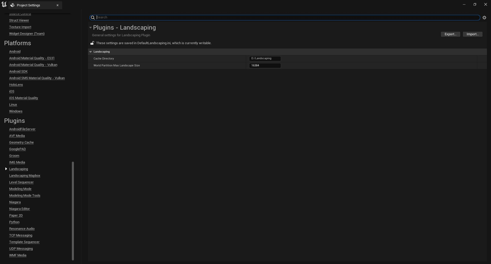
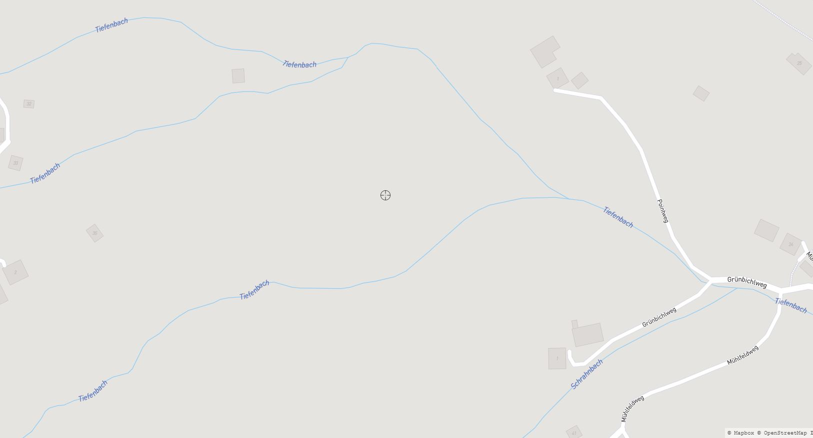

# Settings

Landscaping does provide settings which are saved per project and can be found in `Project Settings -> Plugins -> Landscaping`.  
For settings of __Landscaping Mapbox__ see [Landscaping Mapbox](mapbox.md?id=settings)  

  

## Cache Directory

When importing heightdata (DTM files), intermediate files are generated. They are necessary to circumvent the 2 GB import restriction from Unreal Engine. Please make sure it is set to a writable directory. The plugin will try to create the directory, if it does not exist already.

> The Cache Directory defaults to `C:/Temp/Landscaping`

## Projection Mode

Projection mode for imported GIS data. This should be set before importing any data and never changed when working on a map.

### Automatically reproject to appropriate UTM CRS

UTM CRS (Coordinate Reference System) will be determined by the first imported heightmap or shapefile. On Mapbox Imports this will be EPSG:3857. All imported data will then be reprojected to the determined CRS.

### Use CRS of import file or EPSG:3857 on Mapbox import

Import data will not be reprojected to UTM, but the heightmap's or shapefile's CRS will be used. All data imported afterwards will be reprojected to this CRS. Please make sure that the imported data is in meter to get the real scale.

### Use custom CRS specified below

Reproject imported data to the CRS specified under `Projection`.

## Projection

EPSG code of target CRS to use when importing height data.  
E.g. 3395 for Mercator WGS84.  

> IMPORTANT: only easting/northing CRS with unit meter will work.  

## Enable Large Worlds

This can be used to unload tiles while importing huge areas at once.  

## Allowed DTM File Types

Filetypes recognized for importing DTM files.  

## World Partition Max Landscape Size

The maximum size of a created Landscape in World Partition. If the size of a single Landscape exceeds this size, it will be split, and multiple Landscape Actors are created in the level. This is the size of the resulting Landscape in Unreal engine, not the max size or resolution of a source file (like GeoTiff, etc.). E.g. a value of 32768 will import landscapes with maximum 32 km length or width. 32768 will need at least 128 GB of RAM.

> The World Partition Max Landscape Size defaults to `8192`.  
> Edit Layers can only be activated if the value is `16384` or below.

Tip: you can type aritmetic expressions into the input box like `8192*2` or `8192/2`

## Resample to First Tile

Will import all imported DTM files (or Mapbox height data) to the resolution of the first imported DTM of the level enabling seamless worlds with no gaps. This might lead to up- or downsampling depending on the first imported DTM.  

## Connect Linestrings

Shapefiles with linestrings to create e.g. spline-based roads or rivers can be auto-connected. The linestrings are connected by name.  
Set this to `true`, if there are segmented non-branching roads or rivers.  
Set it to `false` (default), if there are branches.  
The following map shows a branching river (Tiefenbach) - here linestrings cannot be connected in an meaningful way - therefore the value should be set to `false`. This will result in one spline per river branch.  

