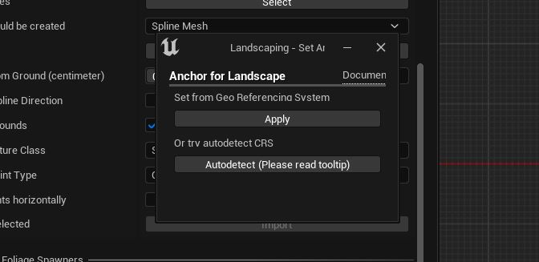

# Shapefile Import without prior DTM import

The normal workflow is to import a Landscape (DTM or from Mapbox) first, and then import the shapefiles accordingly.

It is however possible, to import the shapefiles for an already existing landscape.  

Please note, that the opposite way does not work! It is not possible to import a shapefile and afterwards a DTM!  

## Steps to import a shapefile

If no Landscape is found in the scene, it is possible to create a dummy landscape with no extents here in the `Import Roads, Railtracks, Rivers, etc.` section.  
If a Landscape was not imported through the Landscaping plugin, a popup will appear prior to selecting a Shapefile:  
  
a. `Select LandscapingInfos.txt` let you set the GIS anchor from a textfile, which was [exported prior with PNGs](heights.md?ìd=only-convert-to-pngs).  
b. `Autodetect` trys to set the CRS (Coordinate Reference System) and anchor from the Shapefile. This will not match the landscape, but with the LandscapingInfos Actor in the World Outliner, the Anchor can be moved to match the shapes with the Landscape - see [Enable Vector Debugging](gis-expert.md?id=draw-vector-data-debug).  

The shapes can be adjusted using `XYOffset` and `Vector Data Scale` properties in the `LandscapingInfos` Actors's details panel.  
