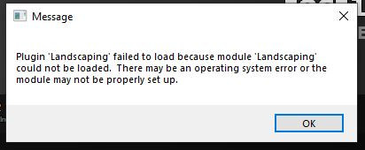

# Troubleshooting

## Unreal Engine Editor won't start

If you see this message:  

Please copy the files and folders from  
`{Engine Plugin Folder}/Marketplace/Landscaping/Source/ThirdParty/Redist/Win64/`  
to  
`{Engine Plugin Folder}/Marketplace/Landscaping/Binaries/Win64/`

The `Engine Plugin Folder` can be found where the Unreal Engine Editor is installed on your system, e.g.  
`C:/Program Files/Epic Games/UE_4.26/Engine/Plugins`

## Changing Levels

When changing levels, the plugin may not detect the new World which is neccessary to save the metadata. Please close the `Landscaping Tab` and open it again. Thank you.

## Edges on the outmost border

Due to the transformation of the input data, on areas, where no data is found the height is set to 0. Therefore, steep edges on outmost borders of the Landscape or World Composition occur. Normally, this is not a problem and does not have any perfomance impacts.  
If one wants to get rid of the steep edges anyway, there are 2 options to solve this:

- The steep edges can be fixed within the native Unreal Engine Landscape Mode Sculpting Tools
- Use the `Corners as Bounding Box` option in the [DTM Import Options](heights.md?id=options) dialog (Choose area on the map)

## Shapefile has wrong offset after reloading Level

- Set XYOffset in the LandscapingInfos Actor to 0/0/0. The LandscapingInfos Actor can be found in the Outliner.

## Artifacts on complex spline deforming Landscape with Paint Layer

When shapes are very complex, artifacts can appear; in that case it is better to import a spline mesh (just assign a cube as `Spline Segment Mesh`) and then in the generated splines hit the `Deform` button in the `Details` tab. If artifacts appear, it can be undone with `Ctrl+Z`. Adjust/delete splines which are twisted or obsolete and hit `Deform` again. The Spline Actor can be deleted after the process. See also: [Video](https://youtu.be/pYNUrNeKF2s?t=557)

## World Partition not showing on World Partition Editor tab

[Check Options](heights.md?id=use-world-partition)

## Crash when not saving the Level on prompt

This is an Unreal Engine bug which will hopefully be resolved in 5.1 - see also [https://issues.unrealengine.com/issue/UE-143891](https://issues.unrealengine.com/issue/UE-143891) - Right now the solution is to save the level when prompted.

## Crashes

If the Unreal Editor crashes on import, it may due to corrupted input data or the Unreal Engine Editor runs out of memory. Memory issues can happen because:  
> `World Partition Max Landscape Size` value is too big [Settings](settings.md)  
> See also: [Choosing input files](heights.md?id=choosing-input-files)  
If you suspect the input data is faulty, you can send the data to `support@ludicdrive.com` to verify it. Thank you.
