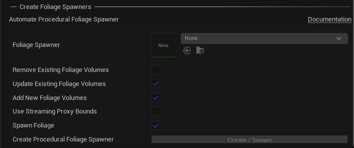

# Vegetation

Leverage Unreal Engines Procedural Foliage Tool to let accelarate foliage creation.

## Automation

This feature helps to populate tiled landscapes with procedural foliage. It loads every level of the tiled landscape, spawns the foliage and then saves and unloads it.  
> In Unreal Engine 5, because the UE API changed, only the `Procedural Foliage Spawner` is created and it's brush size is set to the bounds of the Landscape. Click `Resimulate` in the Details tab of the `Procedural Foliage Spawner` to populate the Landscape with foliage.

## Procedural Foliage

In order for this feature to work, one has to prepare a [Procedural Foliage Spawner](https://docs.unrealengine.com/en-US/BuildingWorlds/OpenWorldTools/ProceduralFoliage/QuickStart/index.html). A `Procedural Foliage Spawner` is mandatory for creating automated plants and trees and also rocks and stones and you name it on the tiled landscape with Landscaping.

## Options

> UE4: Please unload all World Composition tiles before proceeding
> UE5: Please make sure the part of the World Partition you want to spawn foliage is loaded

### Foliage Spawner

Assign a Procedural Foliage Spawner here.

### Remove Existing Foliage Volumes

This will remove any Procedural Foliage Volumes and all InstancedFoliageActors from the level.

### Reuse Existing Foliage Volumes

This option will update the volumes found in a level.

### Add New Foliage Volumes

When checked, will add the Foliage Spawner as new Procedural Foliage Volumes.

### Use Streaming Proxy Bounds

Will use the bounds of the Landscape Streaming Proxies (in World Partition worlds) instead of the bounds of the Landscapes. The Procedural Foliage Volumes will then be smaller which leads to faster generation of procedural foliage. Could often lead to volumes which do not match but are bigger than the bounds of the Landscape Streaming Proxy.

### Spawn Foliage

Whether to spawn foliage right after creating the Procedural Foliage Volume. Unchecked will only create the Volumes.

> Some of the checkboxes will be automatically deselect if another option is checked  

If everything is unchecked, nothing will happen when hitting the `Create` button.

> UE4: Please make sure to unload all Levels of a UE4 World Composition (except the Persistent Level) in the Unreal Engine 4 `Levels` tab before hitting `Create`
> UE5: Please make sure the part of the World Partition you want to spawn foliage is loaded
