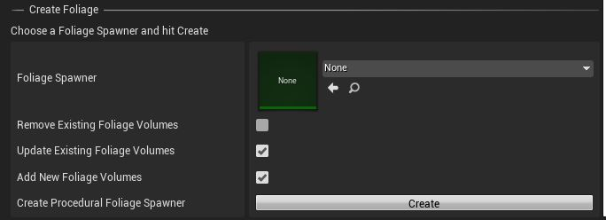

# Vegetation

Leverage Unreal Engines Procedural Foliage Tool to let it grow.

## Automation

This feature helps to populate tiled landscapes with procedural foliage. It loads every level of the tiled landscape, spawns the foliage and then saves and unloads it.

## Procedural Foliage

In order for this feature to work, one has to prepare a [Procedural Foliage Spawner](https://docs.unrealengine.com/en-US/BuildingWorlds/OpenWorldTools/ProceduralFoliage/QuickStart/index.html). A `Procedural Foliage Spawner` is mandatory for creating automated plants and trees and also rocks and stones and you name it on the tiled landscape with Landscaping.

## Options

> Please unload all tiles before proceeding

### Foliage Spawner

Assign a Procedural Foliage Spawner here.

### Remove Existing Foliage Volumes

This will remove any Procedural Foliage Volumes.

### Reuse Existing Foliage Volumes

This option will update the volumes found in a level.

### Add New Foliage Volumes

When checked, will add the Foliage Spawner as new Procedural Foliage Volume.

> Some of the checkboxes will be automatically deselect if another option is checked

Why? Well, if a Foliage Volume gets removed, it cannot be updated anymore.

If everything is unchecked, nothing will happen when hitting the `Create` button.

> Please make sure to unload all Levels of a World Composition (except the Persistent Level) in the Unreal Engine `Levels` tab before hitting `Create`
